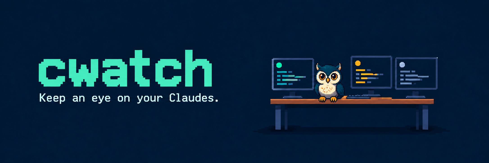
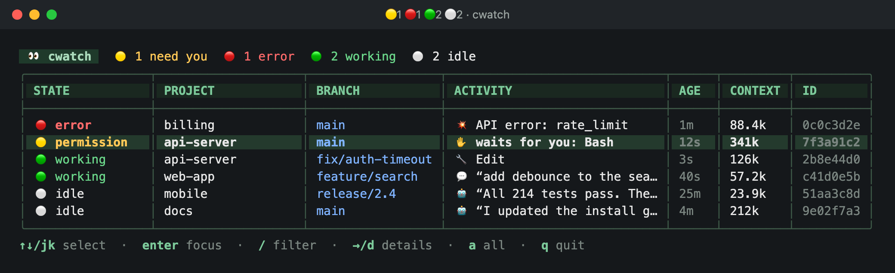
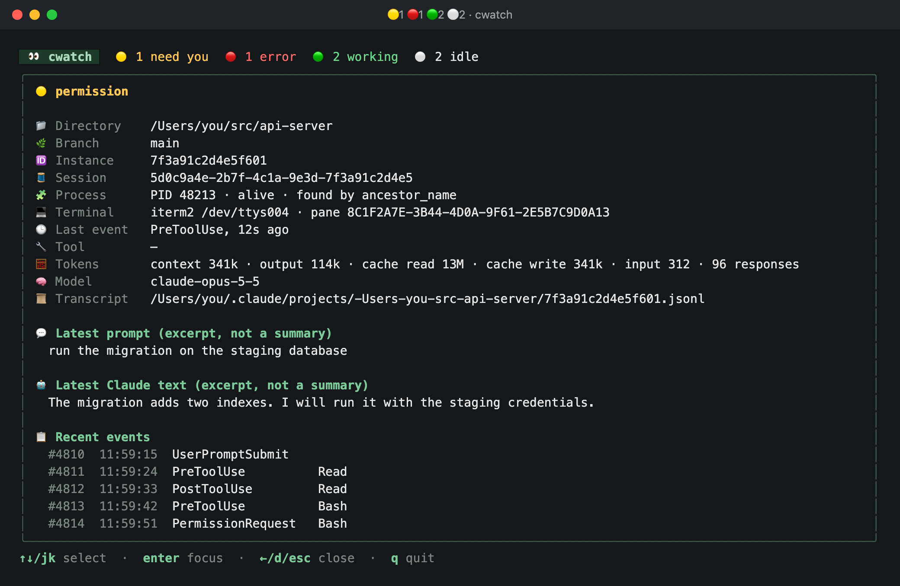
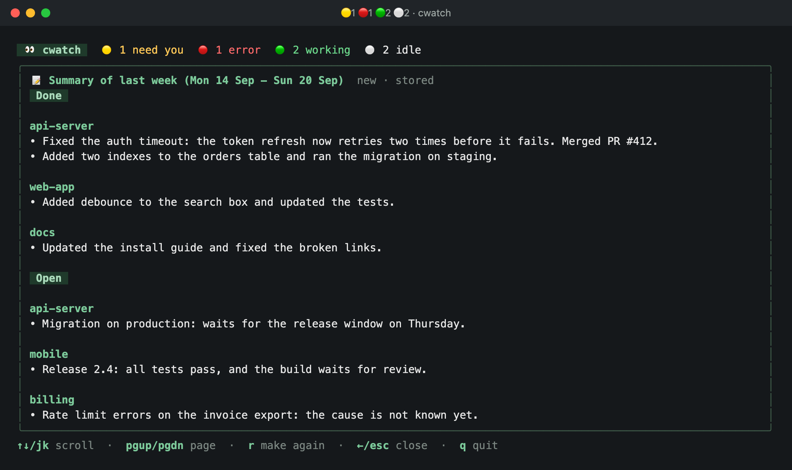

**See all your Claude Code sessions in one place.**

`cwatch` is a dashboard for macOS and iTerm2. It shows each Claude Code session in your windows, tabs, and split panes. You can see at a glance which sessions need you, which work, and which are idle. Push `Enter` to go to the pane of a session.



- 🟡 **permission**: Claude waits for you to approve a tool.
- 🟢 **working**: Claude works on your prompt.
- ⚪ **idle**: Claude finished and waits for your next prompt.
- 🔴 **error**: the turn stopped because of an API error.

The table also shows the project, the git branch, the current tool or the latest message, and the context size in tokens. Push `→` to see the details of a session:



Push `s` to get a summary of your work of yesterday or last week. See [Summary of your work](#summary-of-your-work).

cwatch runs only on your computer. It makes no model calls and uses no network, except `cwatch summary` and `cwatch upgrade`. Its data stays in `~/.cwatch`.

## Install

You need macOS, iTerm2, and Claude Code.

1. Download and install the program. Use `arm64` for Apple silicon and `amd64` for an Intel Mac:

   ```sh
   curl -fsSLO https://github.com/Willis0826/cwatch/releases/latest/download/cwatch-darwin-arm64.tar.gz
   tar -xzf cwatch-darwin-arm64.tar.gz
   sudo install -m 755 cwatch /usr/local/bin/cwatch
   ```

2. Look at the change to your Claude Code settings, then add the hooks:

   ```sh
   cwatch setup --dry-run
   cwatch setup
   cwatch doctor
   ```

3. Restart the Claude Code sessions that already run, then submit a prompt in each.

4. Open the dashboard:

   ```sh
   cwatch
   ```

   | Key | Function |
   |---|---|
   | `↑` `↓` | Select a session. |
   | `Enter` | Go to the pane of the session. |
   | `→` / `←` | Open or close the details. |
   | `/` | Filter. |
   | `s` | Summarise your work of yesterday or last week. |
   | `q` | Quit. |

The first time that you push `Enter`, macOS can ask for permission to control iTerm2. Allow it.

Do not move the program after setup. The hooks contain its path. If you move it, run `cwatch setup` again.

If you download the archive with a web browser, macOS can block the program. To unblock it, run `xattr -d com.apple.quarantine cwatch` before the `install` command.

### Install from source

If you have Go 1.26 or later (`brew install go`), run this command in the project directory instead of steps 1 and 2:

```sh
make setup
```

This command builds and installs `cwatch`, shows the change to your settings, asks you to confirm, adds the hooks, and runs `cwatch doctor`.

## Summary of your work

cwatch can write a bullet list of your work from your Claude Code sessions:

```sh
cwatch summary yesterday
cwatch summary week
```

- `yesterday` is the previous calendar day. `week` is the previous week, from Monday to Sunday.
- The summary has two sections: **Done** for finished work, and **Open** for work that was not finished at the end of the range.
- cwatch reads your transcripts in `~/.claude/projects` and the git commits of your projects. Then it sends a short digest to Claude with `claude -p`. The call uses your Claude Code login.
- cwatch keeps each result in `~/.cwatch/summaries`. The next call shows the stored result immediately. To make the summary again, add `--refresh`.
- In the dashboard, push `s` and select the range. In the summary, push `r` to make it again.



Claude Code keeps transcripts for 30 days by default. cwatch cannot summarise older work.

## Upgrade

To install the latest release, run:

```sh
cwatch upgrade --check   # show the current and the latest version
cwatch upgrade
```

cwatch downloads the release with `curl`, checks the SHA-256 hash, and replaces its own binary. The hooks keep the same path, so you do not need to run `cwatch setup` again. If you cannot write to the install directory, cwatch prints the `sudo` command to use.

`cwatch upgrade` exists from version 0.3.0. To upgrade from an older version, repeat step 1 of the install.

## Uninstall

1. Remove the hooks and the program:

   ```sh
   cwatch uninstall
   sudo rm /usr/local/bin/cwatch
   ```

   If you installed from source, run `make uninstall` in the project directory instead.

   The uninstall removes only the cwatch hooks from your Claude Code settings. Your other settings and hooks do not change.

2. Restart the Claude Code sessions that run.

3. Optional: delete the history.

   ```sh
   rm -rf ~/.cwatch
   ```

---

For the build steps, the commands, and the design, see [DEVELOP.md](DEVELOP.md).
